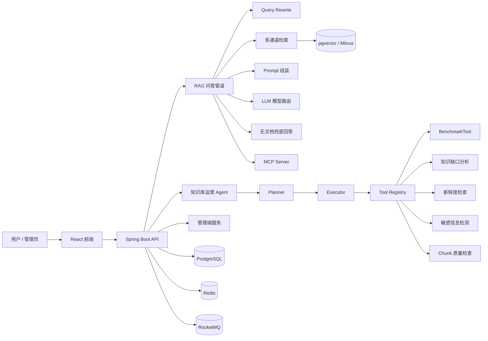
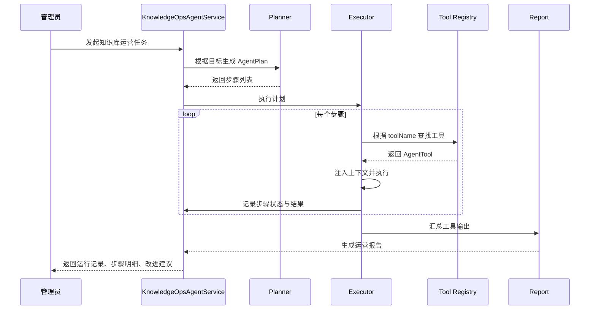
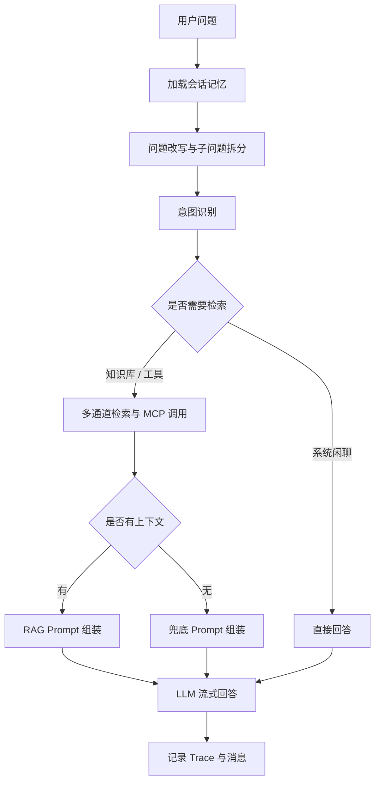

# Agentic RAG 企业知识库自治运营智能体架构说明

## 1. 总体架构

项目采用前后端分离与后端多模块架构，核心目标是把企业知识库从“被动问答系统”升级为“可自主评估、诊断和改进的 Agentic RAG 系统”。

## 2. 模块职责

- `src/bootstrap`: 主应用模块，包含 RAG 问答、Agent 编排、知识库管理、文档摄取、管理端接口和用户认证。
- `src/infra-ai`: AI 基础设施模块，封装 Chat、Embedding、Rerank、模型路由、健康检查和失败降级。
- `src/framework`: 通用工程能力模块，包含统一返回体、异常处理、Trace、Web 配置、Redis、RocketMQ、分布式 ID 等。
- `src/mcp-server`: MCP 工具服务端示例，为主应用提供天气、工单、销售查询等外部工具能力。
- `src/frontend`: React 管理端和问答端，包含聊天、知识库、摄取流水线、Trace、Agent 运营等页面。
- `src/resources`: 数据库初始化脚本、升级脚本、Docker Compose 文件和示例知识库文档。

## 3. Agent 运行流程

## 4. RAG 问答流程

## 5. 数据流设计

- 文档摄取数据流: 文档源进入 `Fetcher`，经 `Parser` 解析、`Chunker` 切分、`Enhancer/Enricher` 增强，最后由 `Indexer` 写入向量库和关系库。
- 问答数据流: 用户问题经改写、意图识别、多通道检索、Rerank 和 Prompt 组装后发送给 LLM，回答过程通过 SSE 推送到前端。
- Agent 运营数据流: Agent 根据计划调用工具，工具读取知识库、检索结果、评测集和运行指标，生成步骤记录、风险项、知识缺口和改进建议。
- 可观测数据流: 每次问答和 Agent 执行都会记录 Trace、步骤状态、耗时、命中文档和工具输出，供管理端复盘。
